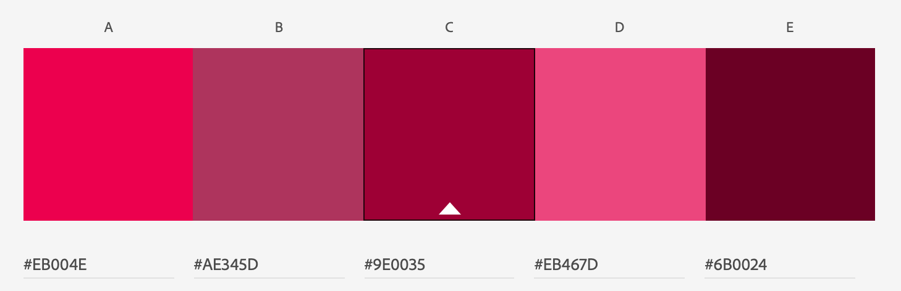
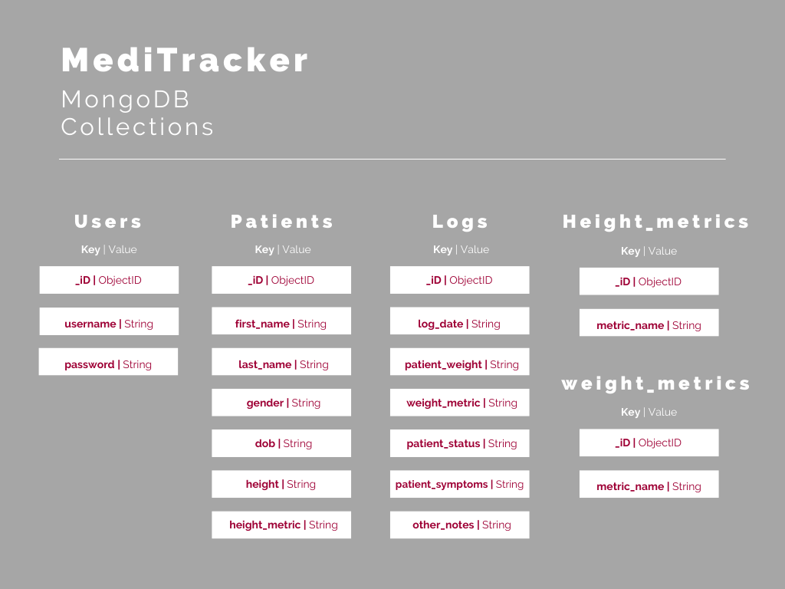
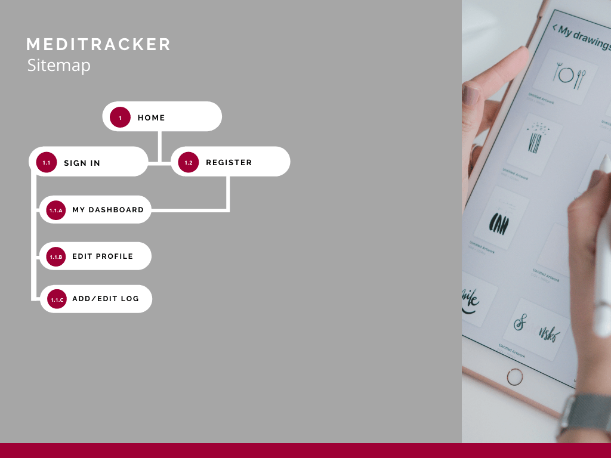

# MediTracker

Code Institute | Milestone Project 3 | Backend Development

View the [MediTracker's live website here]().

## Table of Contents

* [Purpose](##Purpose)
    * [Introduction](###Introduction)
    * [Vision and Mission](###Vision-and-Mission)
    * [Target Audience](###Target-Audience)
* [User Experience Design](##User-Experience-Design)
    * [Design Inspiration](###Design-Inspiration)
    * [Colour Scheme](###Colour-Scheme)
    * [Typography](###Typography)
    * [Logo](###Logo)
    * [User Stories](###User-Stories)
* [Website Structure](##Website-Structure)
    * [Wireframes](###Wireframes)
    * [Mockups](###Mockups)
    * [Database Structure](###Database-Structure)
    * [Sitemap](###Sitemap)
* [Features](##features)
    * [Existing Features](###Existing-Features)
    * [Features to be Implemented](###Features-to-be-Implemented)
* [Technologies Used](##technologies-used)
    * [Languages](###Languages)
    * [Libraries and Frameworks](###Libraries-and-Frameworks)
    * [Tools](###Tools)
* [Testing](##testing)
* [Deployment](##deployment)
    * [Local Deployment](###Loccal-Deployment)
    * [Heroku Deployment](###Heroku-Deployment)
* [Credits](##credits)

## Purpose

### Introduction
With chronic illness prevalence expected to continue rising, it's important that patients are able to monitor their condition(s) and provide their medical team with a clear picture of their disease progression. In addition, the disruptions which COVID-19 has brought to the medical system, makes it's easier for new symptoms or disease progression to potentially be missed until a later point. To tackle this, MediTracker allows patients who deal with chronic illnesses to take control of their symptoms by keeping a log of their disease status over time. They can then share this log with their medical team.

### Vision and Mission
MediTracker's Vision is to empower chronic illness patients to take control of their health and its Mission is to provide patients with a secure web application which allows them to keep logs of their medical records and report it back to their medical team. 

### Target Audience
The target audience for this web application are inviduals who have chronic illnesses and want to get more from their interactions with their medical team by providing an accurate  representation of their symptoms over time, rather than recalling from memory at appointments. 

[Back to top](##Table-of-Contents)

## User Experience Design

### Design Inspiration
I sourced a lot of design inspiration for this website by researching patient portals online and websites for hospitals and GPs. This provided me with a better understanding of the typical user interface for these applications and the type of colour schemes used.

### Colour Scheme
The main base colour chosen for this website (red) was sourced from a patient portal mockup for [Orlando Health](http://struongux.com/ohealth.html). I used Adobe Illustrator's colour picker tools to identify the hexadecimal value for this colour, which was **#9E0035**. I also used [Adobe Color](https://color.adobe.com/create/color-wheel) to generate more monochromatic shades from this base colour, which I used on the homepage. The colour blue appears to be very standard across many medical website designs, so it was nice to try out something a little different here.

### Typography

### Logo

### User Stories

**As a website owner:**

**As a website user:**
* I want a website which is easy to navigate on both mobile and desktop devices
* I want a website which is visually appealing and its purpose immediately apparent
* I want to be able to register to create my own personal account
* I want to feel that my information is secure by creating a password to my personal account
* I want to be able to update my health profile with my personal details
* I want to be able to add and edit logs to record my medical symptoms over time
* I want to be able to delete logs I no longer wish to record
* I want to be able to filter logs by date they were entered
* I want to be able to request an appointment with a medical professional

[Back to top](##Table-of-Contents)

## Website Structure

### Wireframes

I created wireframes for this web application using [balsamiq](https://balsamiq.com/wireframes/):

**Desktop wireframes:**
* [Homepage Wireframe](images/readme/homepage-desktop-wireframe.png)
* [Register Wireframe](images/readme/register-desktop-wireframe.png)
* [Sign In Wireframe](images/readme/signin-desktop-wireframe.png)
* [Dashboard Wireframe](images/readme/dashboard-desktop-wireframe.png)
* [Health Profile Wireframe](images/readme/edit-profile-desktop-wireframe.png)
* [Add Log Wireframe](images/readme/add-log-desktop-wireframe.png)

**Mobile Wireframes**

**Tablet Wireframes**

### Mockups
I created some higher fidelity desktop mockups for the key pages on the website. This provided me with an opportunity to sample my chosen colours and ensure the layout I had wireframed looked visually appealing. Please see desktop mockups below:

* [Homepage Mockup](images/readme/homepage-mockup.png)
* [Register Mockup](images/readme/register-mockup.png)
* [Sign In Mockup](images/readme/sign-in-mockup.png)
* [Dashboard Mockup](images/readme/dashboard-mockup.png)
* [Health Profile Mockup](images/readme/health-profile-mockup.png)
* [Add Log Mockup](images/readme/add-log-mockup.png)

### Database Structure

MongoDB was used to set up the database for MediTracker. I used [Canva](www.canva.com) to illustrate the collections, along with their documents, in the image below:

### Sitemap

I also used Canva to design a sitemap for this website as displayed below:

[Back to top](##Table-of-Contents)

## Features

### Existing Features

### Features To Be Implemented

[Back to top](##Table-of-Contents)

## Technologies Used

### Languages
* [HTML]() was the main language used to create this website
* [CSS]() was used to add bespoke design
* [JavaScript]() was used to create interactive elements on the website
* [Python]() was used for the backend of the website

### Libraries and Frameworks

### Tools
* [Adobe Illustrator](https://www.adobe.com/ie/products/illustrator.html) was used to create the logo and high fidelity mock ups
* [TinyPNG](https://tinypng.com/) was used to reduce the size of all the images on the website
* [Google Fonts](https://fonts.google.com/) was used to find, sample and import fonts for the logo and website
* [balsamiq](https://balsamiq.com/wireframes/) was used to create low-fidelity wireframes of the website
* [Git](https://git-scm.com/) was used as the version control software to add, commit and push code to the GitHub repository
* [Gitpod](https://gitpod.io/) was used as the development environment to write my code
* [GitHub](https://github.com/) is the hosting site used to store the source code for the Website
* [W3C Markup validator](https://validator.w3.org/) was used regularly to check for any errors in the HTML on the site
* [W3C CSS validator](https://jigsaw.w3.org/css-validator/) was used regularly to check for any errors in the CSS on the site

[Back to top](##Table-of-Contents)