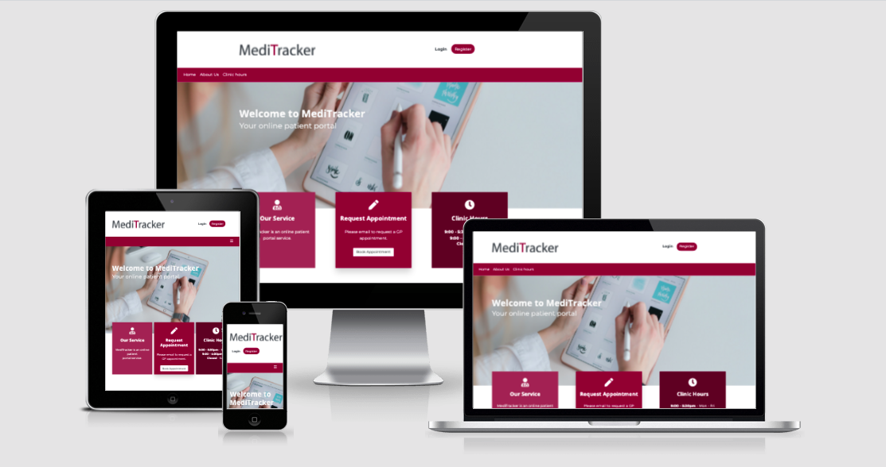
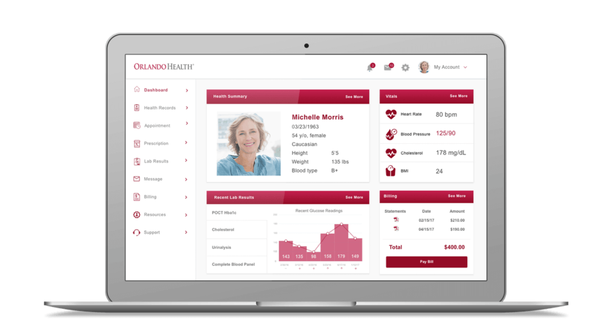
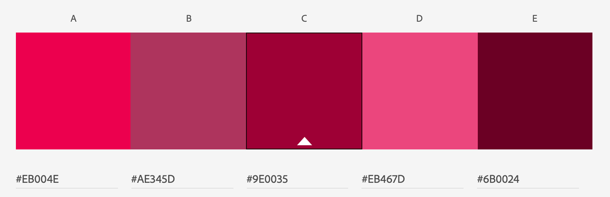
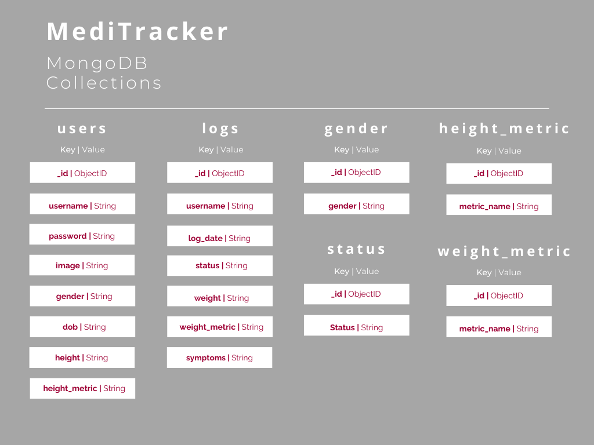
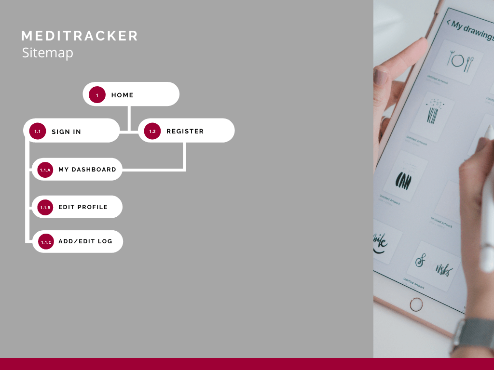

# MediTracker

## Purpose

### Introduction
With chronic illness prevalence expected to continue rising, it's important that patients are able to monitor their condition(s) and provide their medical team with a clear picture of their disease status. Furthermore, the disruptions which COVID-19 has brought to healthcare systems across the globe system makes it easier for new symptoms of disease progression to potentially be missed until a later stage.

To tackle this problem, I have devised a patient portal application called MediTracker. MediTracker allows chronic illness patients to take control of their health by keeping logs of their disease over time. They can demonstrate these logs to their medical team at appointments to provide them with a more accurate account of their disease activity. In addition, these logs help medical professionals to provide better patient care by seeing their disease activity over time.

**Please note, this project is for educational purposes only. Do not share your own personal medical information.**

---

## Table of Contents

* [Purpose](#Purpose)
    * [Introduction](#Introduction)
    * [Vision and Mission](#Vision-and-Mission)
    * [Target Audience](#Target-Audience)
* [User Experience Design](#User-Experience-Design)
    * [Goals](#Goals)
        * [Application Owner Goals](#Application-Owner-Goals)
        * [Medical Professional Goals](#Medical-Professional-Goals)
    * [User Stories](#User-Stories)
    * [Design Inspiration](#Design-Inspiration)
    * [Colour Scheme](#Colour-Scheme)
    * [Typography](#Typography)
    * [Logo](#Logo)
* [Website Structure](#Website-Structure)
    * [Wireframes](#Wireframes)
    * [Mockups](#Mockups)
    * [Database Structure](#Database-Structure)
    * [Sitemap](#Sitemap)
    * [Site Structure and Implementation](#Site-Structure-and-Implementation)
* [Features](#features)
    * [Existing Features](#Existing-Features)
    * [Features to be Implemented](#Features-to-be-Implemented)
* [Technologies Used](#technologies-used)
    * [Languages](#Languages)
    * [Libraries and Frameworks](#Libraries-and-Frameworks)
    * [Tools](#Tools)
* [Testing](#Testing)
* [Deployment](#deployment)
    * [Project Creation](#Project-Creation)
    * [Heroku Deployment](#Heroku-Deployment)
    * [Local Deployment](#Local-Deployment)
* [Credits](#credits)
    * [Code](#Code)
    * [Acknowledgements](#Acknowledgements)

### Vision and Mission
MediTracker's Vision is to empower chronic illness patients to take control of their health. Its Mission is to provide patients with a secure web application which allows them to keep logs of their medical records and report it back to their medical team. 

### Target Audience
The target audience for this application are both medical professionals who want to provide better patient care and chronic illness patients who want to take control of their health by improving their record keeping of their disease symtpoms for their medical team and also for their own personal reference.

## User Experience Design

### Goals

#### Application Owner Goals
* As the application owner, I want to improve the standard of care between patients and medical professionals
* As the application owner, I want to provide hospitals and General Practicioners with a patient portal application to share with their patients so they can better monitor their health
* As the application owner, I want to provide chronic illness patients with a way to create, read, update and delete medical data
* As the application owner, I want to empower chronic illness patients to take control of their health
* As the application owner, I want to provide a secure application to patients, hospitals and GPs

#### Medical Professional Goals
* As a medical professional, I want to improve the standard of patient/GP care
* As a medical professional, I want to provide my patients with a secure patient portal
* As a medical professional, I want to empower my patients to take control of their medical condition(s) by keeping their own logs
* As a medical professional, I want to better understand my patient's disease activity

The end users of this website will be patients and their user stories are outlined below:

### User Stories
* As a patient, I want a web application which is easy to navigate on both mobile and desktop devices
* As a patient, I want a web application which is visually appealing and its purpose immediately apparent
* As a patient, I want to be able to register to create my own personal account
* As a patient, I want to feel that my information is secure by creating a password to my personal account
* As a patient, I want to be able to update my health profile with my personal details
* As a patient, I want to be able to add and edit logs to record my medical symptoms over time
* As a patient, I want to be able to delete logs I no longer wish to record
* As a patient, I want to be able to filter logs by the date they were entered
* As a patient, I want to be able to request an appointment with my medical team

### Design Inspiration

Before developing this application, I dedicated time to exploring patient portal application design online and websites for hospitals and GPs to gather design inspiration. I used applications such as Pinterest, Behance and Google. This provided me with a richer understanding of the typical user interfaces for medical applications and the type of colour schemes used. 

### Colour Scheme
From my research outlined above, it was evident that the colour blue was very standard across many medical website designs and this is because blue is often ["associated with credibility, trust, knowledge, power, professionalism, cleanliness, calm and focus"](https://doctormultimedia.com/medical-logos-blue/). 

However, I came across a patient portal mockup for [Orlando Health](http://struongux.com/ohealth.html) which in contrast used a deep wine red for its colour scheme. This really stood out to me as it was something different and memorable.

Although red seems to be more uncommon in medical website design, as we often associate it with danger, the deepness of this particular red made it more subtle and less provoking of the feelings of danger and alert. Thus, I decided to use this as the main base colour for MediTracker as it's a distinctive brand colour and the application is not directly that of a hospital or General Practicioner's website. 

I used Adobe Illustrator's colour picker tool to identify the hexadecimal value for this colour, which was **#9E0035**. I then used [Adobe Color](https://color.adobe.com/create/color-wheel) to generate more monochromatic shades from this base colour which I used on the homepage. The result was a strong brand colour for MediTracker.

### Typography
For the typography, I researched popular fonts for medical websites and discovered a site which lists the [Most Used Google Fonts on Hospital Websites](https://www.ilovewp.com/resources/medical/wordpress-for-hospitals/most-used-google-fonts-on-hospital-websites/). I used this as a basis for choosing a font and decided to go with Open Sans for the headings and Montserrat for paragraph text. These are both sans serif fonts and I imported them into the CSS file from [Google Fonts](https://fonts.google.com).

### Logo

I created the logo using Adobe Illustrator. It consists of Lato Bold for the font and the 'T' in same red used on the website.

[Back to top](#Table-of-Contents)

## Website Structure

### Wireframes

I created wireframes for this web application using [balsamiq](https://balsamiq.com/wireframes/):

**Desktop wireframes:**

Desktop Wireframes | Mobile Wireframes | Tablet Wireframes
------------------ | ------------------ | ----------------
[Homepage](wireframes/homepage-desktop-wireframe.png) | [Homepage](wireframes/mobile-homepage-wireframe.png)
[Register](wireframes/register-desktop-wireframe.png) | [Register](wireframes/mobile-register-wireframe.png) 
[Sign In](wireframes/signin-desktop-wireframe.png) | [Sign In](wireframes/mobile-sign-in-wireframe.png)
[Dashboard](wireframes/dashboard-desktop-wireframe.png) | [Dashboard](wireframes/mobile-dashboard-wireframe.png)
[Health Profile](wireframes/edit-profile-desktop-wireframe.png) | [Health Profile](wireframes/mobile-edit-profile-wireframe.png)
[Add Log](wireframes/add-log-desktop-wireframe.png) | [Add Log](wireframes/mobile-add-log-wireframe.png)

### Mockups
I also created some higher fidelity desktop mockups for the key pages on the website. This provided me with an opportunity to sample my chosen colours and ensure the layout I had wireframed looked visually appealing. Please see desktop mockups below:

Desktop Mockups |
--------------- |
[Homepage Mockup](wireframes/homepage-mockup.png)
[Register Mockup](wireframes/register-mockup.png) 
[Sign In Mockup](wireframes/sign-in-mockup.png)
[Dashboard Mockup](wireframes/dashboard-mockup.png)
[Health Profile Mockup](wireframes/health-profile-mockup.png)
[Add Log Mockup](wireframes/add-log-mockup.png)

### Database Structure

MongoDB was used to set up the database for MediTracker. I used [Canva](www.canva.com) to illustrate the collections, along with their documents, in the image below:

### Sitemap

I also used Canva to design a sitemap for this website as displayed below:

### Site Structure and Implementation]

[Back to top](#Table-of-Contents)

## Features

The websites features and how they meet the user stories identified at the beginning of the README document are outlined in greater details below:

### Existing Features

* Fully responsive website which rescales to preserve user experience across all device sizes
* Visually appealing website throughout with a strong use of colour and whitespace making for an intuitive design 
* Homepage displays relevant content and images making its purpose immediately evident
* Registration functionality for users to access a private dashboard area
* Sign in/sign out functionality for registered users
* Site wide footer which includes links to other pages, copyright and social icons
* A 'back to top' button to maximise usability on dashboard when multiple logs are created
* Profile section on dashboard which is fully customisable by the user (CRUD) to include an image and health information
* Log section on dashboard displaying a list of logs added by the user and which are fully customisable (CRUD)
* Defensive programming on user dashboard which ensures nothing can be deleted without a two step approval

### Features To Be Implemented
Given the scope and timeframe for this project, not all features could be implemented. Other features to be added in the future include:  

* Sort logs by date and with most recent appearing first
* A 'Forgot Password' functionality
* Add pagination to reduce scrolling and set the max number of logs displayed to 10 on the dashboard
* Have the functionality to upload an image as opposed to using an image URL
* Have the option to filter patient logs by 'patient status' so it's quick to locate days when they were having a flare up of symptoms
* Provide users with a walk through tutorial on how to use the Dashboard and update the profile and add logs
* Provide the user with the last date they logged in on their Dashboard
* Implement a medical professional login in a future release so they can access their patient data online 

[Back to top](#Table-of-Contents)

## Technologies Used

### Languages
* [HTML](https://en.wikipedia.org/wiki/HTML) was the main language used to create this website
* [CSS](https://en.wikipedia.org/wiki/CSS) was used to add bespoke design
* [JavaScript](https://en.wikipedia.org/wiki/JavaScript) was used to create interactive elements on the website
* [Python](https://www.python.org/) was used for the backend of the website

### Libraries and Frameworks
* [Flask](https://flask.palletsprojects.com/en/2.0.x/) was the chosen micro web framework
* [Bootstrap](https://getbootstrap.com/) was used as the front-end framework
* [Google Fonts](https://fonts.google.com/) was used to find, sample and import fonts for the logo and website
* [Font Awesome](https://fontawesome.com/) was used for icons across the website

### Tools
* [Adobe Illustrator](https://www.adobe.com/ie/products/illustrator.html) was used to create the logo and high fidelity mock ups
* [TinyPNG](https://tinypng.com/) was used to reduce the size of all the images on the website
* [balsamiq](https://balsamiq.com/wireframes/) was used to create low-fidelity wireframes of the website
* [Git](https://git-scm.com/) was used as the version control software to add, commit and push code to the GitHub repository
* [Gitpod](https://gitpod.io/) was used as the development environment to write my code
* [GitHub](https://github.com/) is the hosting site used to store the source code for the Website
* [MongoDB Atlas](https://www.mongodb.com/) was used for the database
* [PyMongo](https://pypi.org/project/pymongo/) provided tools for interacting with MongoDB from Python
* [Jinja](https://jinja.palletsprojects.com/en/3.0.x/) was used for templating
* [Heroku](https://heroku.com/) was used to run the application in the cloud
* [W3C Markup validator](https://validator.w3.org/) was used regularly to check for any errors in the HTML on the site
* [W3C CSS validator](https://jigsaw.w3.org/css-validator/) was used regularly to check for any errors in the CSS on the site

[Back to top](#Table-of-Contents)

## Deployment

### Project Creation

This project was created on GitHub using the following steps:
* A new repository was created using the [CI full template tempates](https://github.com/Code-Institute-Org/gitpod-full-template)
* I gave my repository a meaningful name and clicked 'Create repository'
* Once the repository was created, I opened it on GitHub and clicked the 'Gitpod' button to build the workspace
* Version control was used throughout the project using the following commands:
    * git commit -m "descriptive updates" - This command was used to commit changes to the local repository
    * git push - This command was used to push all committed changes to the GitHub repository

### Heroku Deployment

**Setup Files**
* Tell Heroku which applications and dependencies are required to run our app by setting up a requirements.txt and Procfile: 

> pip3 freeze --local > requirements.txt

> echo web: python app.py > Procfile

**Create Application**
1. Login to Heroku account
2. Click on the 'New' button
3. Select the 'Create new app' button
4. Create a unique app name
5. Choose relevant region

**Connect App to GitHub Repository**
1. Select GitHub from the 'Deployment Method'
2. Enter the repository name for the project and click search
3. When the repository has been found, click to connect to this app

**Set Environement Variables**
1. Click on settings tab for your app
2. Click on 'Reveal Config Vars'
3. Securely tell Heroku which variables are required using the key value pairs listed below:
> IP = 0.0.0.0
> PORT = 5000
> SECRET_KEY = YOUR_SECRET_KEY
> MONGO_URI = YOUR_MONGODB_URI
> MONGO_DBNAME = DATABASE_NAME

**Enable Automatic Deployment:**
1. Go back to the 'Deploy' tab
2. In the 'Automatic deploys' section, select to enable automatic deploys 

### Local Deployment

The following steps are required to run this locally: 

1. Go to the GitHub [repository](https://github.com/JessicaJuliet/meditracker)
2. Click the 'Code' dropdown menu
3. Copy Git URL from HTTPS box (https://github.com/JessicaJuliet/meditracker.git), or select to download the ZIP file
4. If usings the Git URL, open a new terminal in your IDE and type the 'git clone' command in the CLI and paste the copied URL
5. A clone of this project will be created locally on your machine
5. Alternatively, if you download the ZIP, unpackage locally and open in your IDE

[Back to top](#Table-of-Contents)

## Credits

### Code
* Bootstrap Navbar - https://getbootstrap.com/docs/4.0/components/navbar/
* Bootstrap drowdown menu - https://getbootstrap.com/docs/4.0/components/dropdowns/ 
* Back-to-top button - https://www.w3schools.com/howto/howto_js_scroll_to_top.asp

### Acknowledgements
I would like to thank the following people for help with my project:
* All of the tutors who have supported through various obstacles which I came up against
* My mentor Simen [Eventry_mentor](https://github.com/Eventyret) for his guidance and motivation throughout this project
