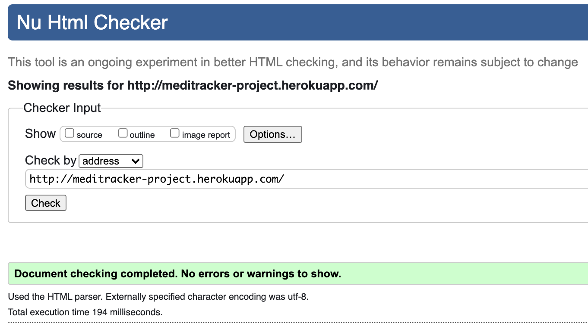
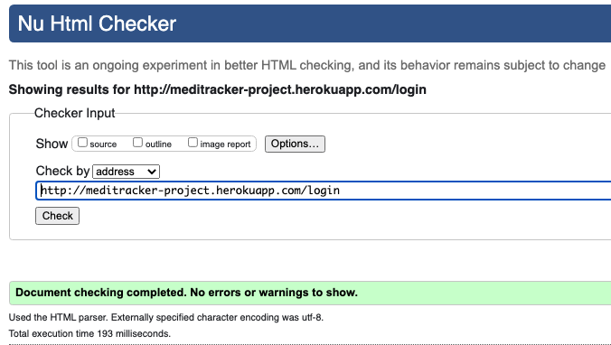

## Automated Testing

### CSS Validation Check

The website's CSS passed the W3C CSS Validation checker:

**CSS: Pass**

### W3C Markup Validation Check

The website's HTML passed the W3C HTML Validation checker:

**Homepage: Pass**

**Login Page: Pass**

**Register Page: Pass**

**Issues and Fixes**

* Homepage HTML validation
    * Issues: Incorrect use of div element within a span and duplicate class
    * Fix: Updated to meet passing requirements
* Login/ Register HTML validation
    * Issue: Incorrect use of button tag
    * Fix: Changed to 'a' tag

### Python PEP8 Compliant

The website's Python code was checked for [PEP8 compliance](http://pep8online.com/) and returned no errors:

### JSHint JavaScript Test

The website's JavaScript was tested for errors using [JSHint](https://jshint.com/).

**Issues and Fixes**

JSHint returned three warnings - two related to the use of 'const' in ES6 which didn't require attention. Another was in relation to a mission semicolon, however this line of code contained the appropriate semicolons.

### Web Accessibility 

The website's homepage was tested to ensure it was accessible to people with disabilities using the [Web Accessibility](https://www.webaccessibility.com/) checker.

**Issues and Fixes**

Three violations were highlighted to ensure link text is meaningful within context for the social media links. As these were icons, and did not contain text, I left these unchanged. Overall, the homepage received a good score of 89%.

## Linter

A linting error remains in the terminal "'env' important but unused". This error was ignored as the env.py file is not discoverable and thus performing as desired.

## Manual Testing

> As a patient, I want the main purpose of the website to immediately apparent upon entering so I understand what the site is used for

#### Test Case 1

**Description:**
Verify site logo displays across all website pages for non-registered and registered users
**Steps:**
1. Open Chrome and navigate to website
2. Check logo appears on homepage
3. Sign into account and navigate through all pages to check logo appears on all of them 
4. Repeat above steps on mobile

**Expected Result:**
Logo displays on all website epages

**Actual Result:**
Logo displays on all website pages

**Pass/Fail:**
Pass

#### Test Case 2

**Description:**
Verify the homepage displays a hero image
**Steps:**
1. Open Chrome and navigate to website
2. Check hero image displays on homepage
3. Check hero text displays over image
4. Repeat above steps on mobile

**Expected Result:**
Hero text displays over hero image 

**Actual Result:**
Hero text displays over hero image

**Pass/Fail:**
Pass

#### Test Case 3

**Description:**
Verify the homepage displays an 'About' section 
**Steps:**
1. Open Chrome and navigate to website homepage
2. Scroll down to ensure About section appears
3. Repeat above steps on mobile

**Expected Result:**
About section appears on homepage

**Actual Result:**
About section appears on homepage

**Pass/Fail:**
Pass

---

> As a patient, I want a web application which is easy to navigate on mobile, tablet and desktop devices

#### Test Case 4
**Description:**
Verify the website's responsiveness across varying device types
**Steps:**
1. Navigate to website on Chrome
2. Open up Chrome Google Developer Tools
3. Use 'Responsive' tool to test responsiveness across all pages on website

**Expected Result:**
Website rescales for varying device types 

**Actual Result:**
Website rescales for varying device types 

**Pass/Fail:** Pass

#### Test Case 5
**Description:**
Verify the hamburger menu appears on small devices
**Steps:**
1. Navigate to website homepage on mobile device
2. Ensure hamburger icon displays 
3. Ensure hamburger icon opens with functioning links

**Expected Result:**
Navbar displays and functions on mobile

**Actual Result:**
Navbar displays and functions on mobile

**Pass/Fail:**
Pass

#### Test Case 6
**Description:**
Verify all pages container a navbar and footer with the correct links

**Steps:**
1. Navigate to website in Chrome
2. Check homepage containers header and footer with correct links
3. Login and ensure all logged in pages display header and footer with correct links

**Expected Result:**
Header and footer display with links functioning

**Actual Result:**
Header and footer display with links functioning

**Pass/Fail**
Pass

#### Test Case 7
**Description:**
Ensure 'back-to-top' button display on dashboard

**Steps:**
1. Navigate to website on Chrome
2. Sign into account dashboard
3. Check back-to-top button appears when scrolling down page
4. Click button to check it brings page to top

**Expected Result:**
'Back-to-top' button appears and scrolls page to top on click

**Actual Result:**
'Back-to-top' button appears and scrolls page to top on click

**Pass/Fail:**
Pass

### Issues and Fixes during testing of deployed website

* Test Case 4:
    * Issue: 'Cancel' button jumped beneath 'Update Profile' and 'Update log' buttons for mobile devices
    * Fix: Reduce side padding on buttons from 40px to 15px

---

> As a patient, I want a website which is visually appealing and looks professional so I feel confident in storing my medical data

#### Test Case 8
**Description:**
Verify consistent colours and styling across website

**Steps:**
1. Navigate to website on Chrome
2. View homepage colours and layout and ensure all are consistent
3. Login to dashboard and ensure colours and styling are consistent for logged in users

**Expected Result:**
Consistent styling and colour theme across website

**Actual Result:**
Consistent styling and colour theme across website

**Pass/Fail:**
Pass

---

> As a patient, I want to be able to register to create my own personal account and feel that my information is secure

#### Test Case 9
**Description:**
Verify registration functionality form performs as expected

**Steps:**
1. Navigate to website's register page on Chrome
2. Ensure the contact form is visible and containers the following fileds
    1. Username
    2. Password
    3. GDPR consent box
3. Enter the following data into the form fields
    1. Username: TestLogin
    2. Password: TestLogin
    3. Check GDPR box
4. Click Register

**Expected Result**
Form submits without errors

**Actual Result**
Form submits without errors

**Pass/Fail** Pass

#### Test Case 10
**Description:**
Ensure registration functionality form performs as expected when incorrect or null data is added

**Steps:**
1. Navigate to website's register page on Chrome
2. Ensure the contact form is visible and contains the following fileds
    1. Username
    2. Password
    3. GDPR consent box
3. Submit the form when the username is blank and ensure a warning appears to say 'Please fill in this field'. Repeat the same for password and GDPR box
4. Submit the form when the username has the incorrect format and ensure a warning message appears outlining the required format. Repeat same for password

**Expected Result**
Form will not submit with incorrect or null data

**Actual Result**
Form will not submit with incorrect or null data

**Pass/Fail**
Pass

--- 
> As a patient, I want to be able to update my health profile with my personal details

#### Test Case 11

**Description:**
Verify patient can update, edit and delete their health profile when logged in

**Steps:**
1. Open Chrome and navigate to website
2. Login and go to dashboard
3. Click to edit profile
4. Enter image url, gender, dob and height
5. Click to update profile
6. Click to edit profile on dashboard
7. Submit new data
8. Click to delete profile
9. Ensure that modal appears to confirm deletion

**Expected Result:**
Users can create, read, update and delete profile data which displays on dashboard

**Actual Result:**
Users can create, read, update and delete profile data which displays on dashboard

**Pass/Fail:**
Pass

### Issues and Fixes during testing of deployed website

* Test case 11:
    * Issue: Cancel button updates form 
    * Fix: Replace 'button' tag with 'a' tag and remove type="submit"

--- 

> As a patient, I want to be able to record my medical logs and have the ability to edit and delete data I no longer wish to record

#### Test Case 12

**Description:**
Ensure that users can create, read, update and delete medical logs

**Steps:**
1. Go to Chrome and navigate to website
2. Login to account dashboard
3. Click to create new log
4. Fill in form data and submit
5. Ensure log appears on dashboard
5. Click to edit log on dashboard
6. Update fields and submit
7. Ensure updated fields display on dashboard
8. Click to delete log
9. Ensure that modal appears to confirm deletion

**Expected Result**
Users can create, read, update and delete medical logs

**Actual Result**
Users can create, read, update and delete medical logs

**Pass/Fail**
Pass

---

> As a patient, I want to be able to request an appointment with my medical team

#### Test Case 13

**Description:**
Verify that patients can email the medical team

**Steps:**
1. Open Chrome and navigate to website
2. Click 'Request Appointment' button on homepage
3. Ensure button opens email client

**Expected Result**
Email client opens

**Actual Result**
Email client opens

**Pass/Fail**
Pass

---
#### Google Chrome's Console

I checked Google Chrome's Console for any errors. It displayed the following for the JavaScript file:

* Issue:

* Fix: These errors were caused when the index.html had loaded, the JavaScript code was trying to attach an event listener to the dateToday, but it only exists on the dashboard.html file. To fix this error, I imported the JavaScript to the dashboard.html between  tags. This resolved the console errors.

#### Website links

All website links were checked across the website to ensure there were no broken links.

#### Bugs left unfixed

As part of the testing, I submitted this project to the Code Institute's peer-to-peer code review channel in Slack. A few minor issues were detected and fixed:

* Flash message padding on mobile to be increased
* Page link rename to avoid confusion and improve UX

One issue remains:

* The 'Book Appointment' button failed to work on iPhone 11 devices (Safari and Chrome)
* I was unable to recreate this issue on my iPhone XS Max device and given the timeframe couldn't find a solution to this
* In a future release, this will be address to ensure the 'Request Appointment' button works across all devices

